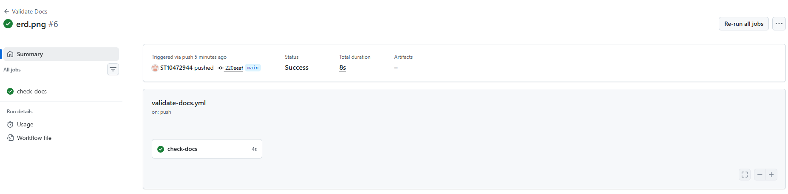

# RaceDay – Event Management System

## Overview
RaceDay is a full‑stack web application for managing road running, walking, and cycling events in South Africa. This repository contains Part 1: planning and database design.

## Roles
- **Organiser**: Creates/manages events, categories, captures results.
- **Participant**: Browses events, enrols, views personal results.

## CI/CD Build Status

## Video Presentation
[Watch the walkthrough video](PASTE_YOUR_YOUTUBE_LINK_HERE)

## Setup Instructions
1. Clone this repository.
2. Run `database.sql` on a SQL Server instance (SSMS) to create the database.
